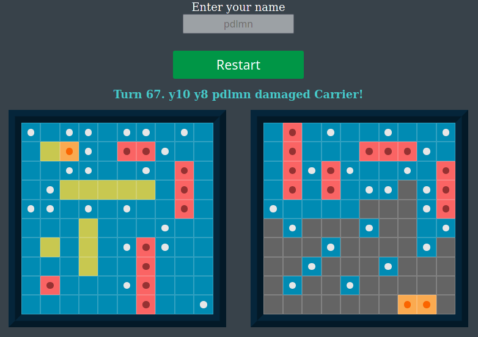

# Battleship

PLAY LIVE HERE https://pdlmn.github.io/battleship/

My spin on the Battleship game! Made with JavaScript, HTML & CSS, as well as with webpack, Babel, Jest and StanardJS.

This was the project that I used to get familiar with TTD and Jest specifically and testing in general. The game itself is decoupled from the DOM as much as possible and has solid testing coverage. The game uses PubSub design pattern for further decoupling.

The game also features pretty smart AI and is mobile responsive.

